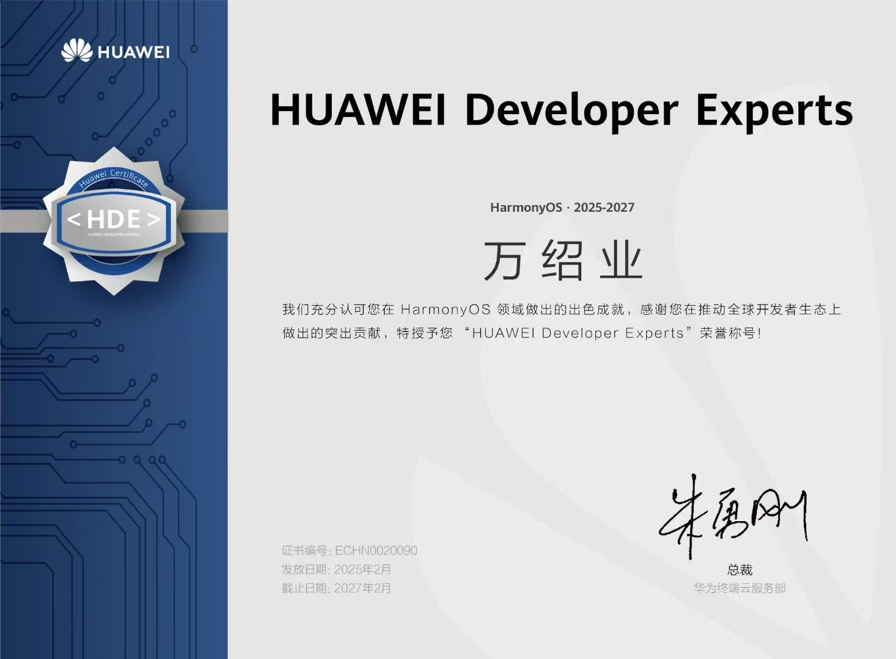
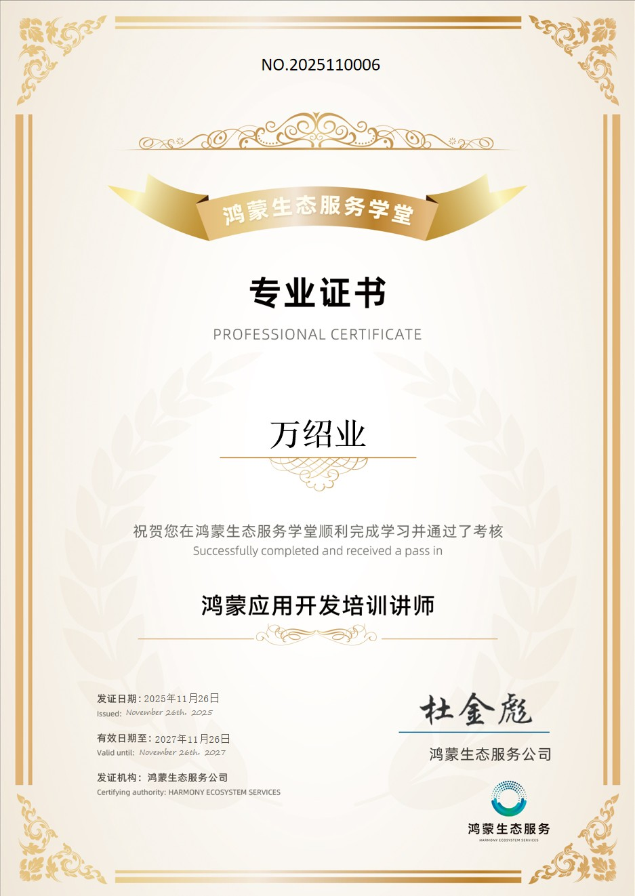
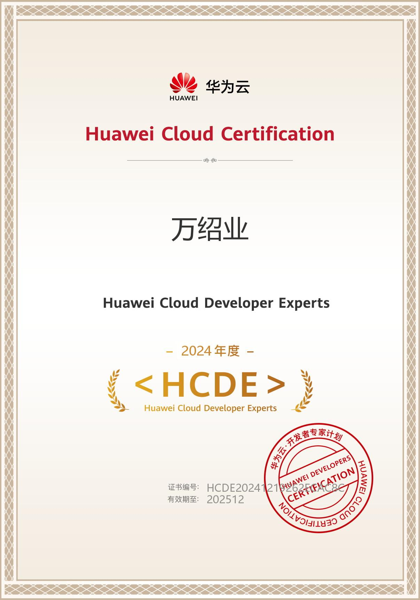
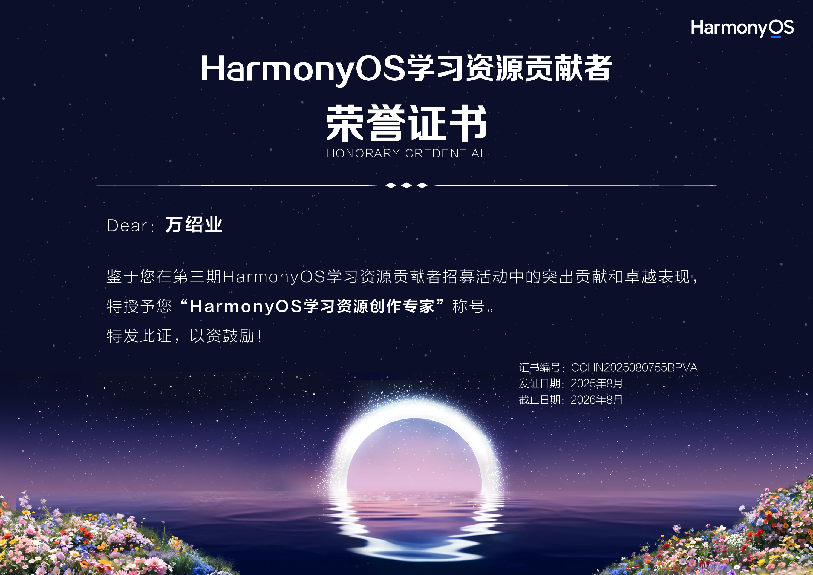
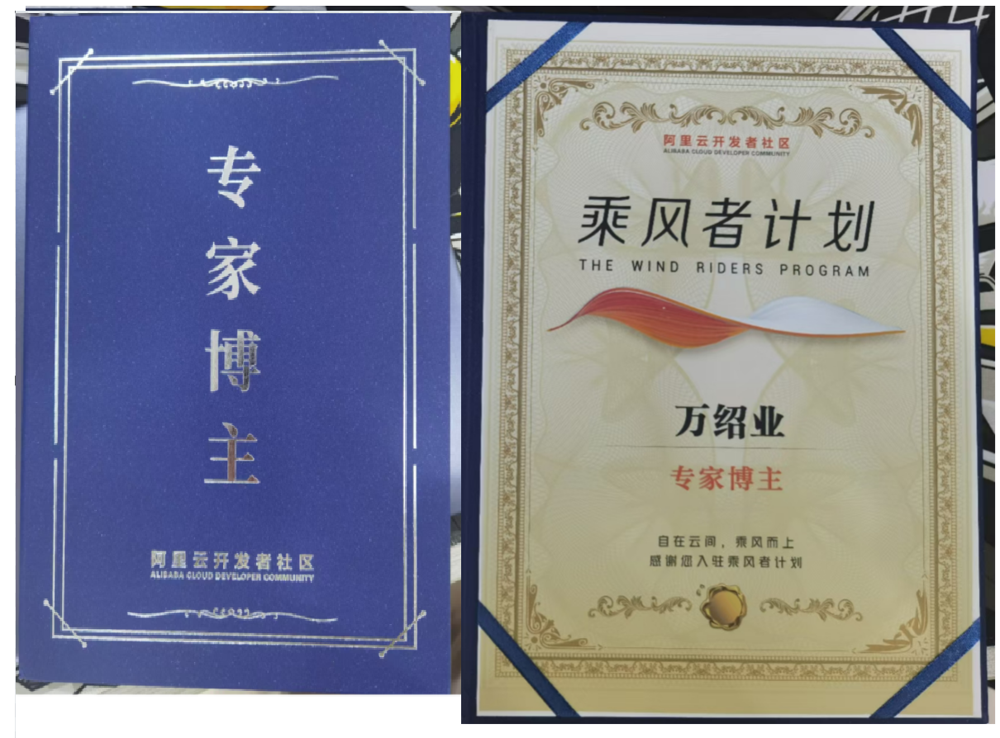
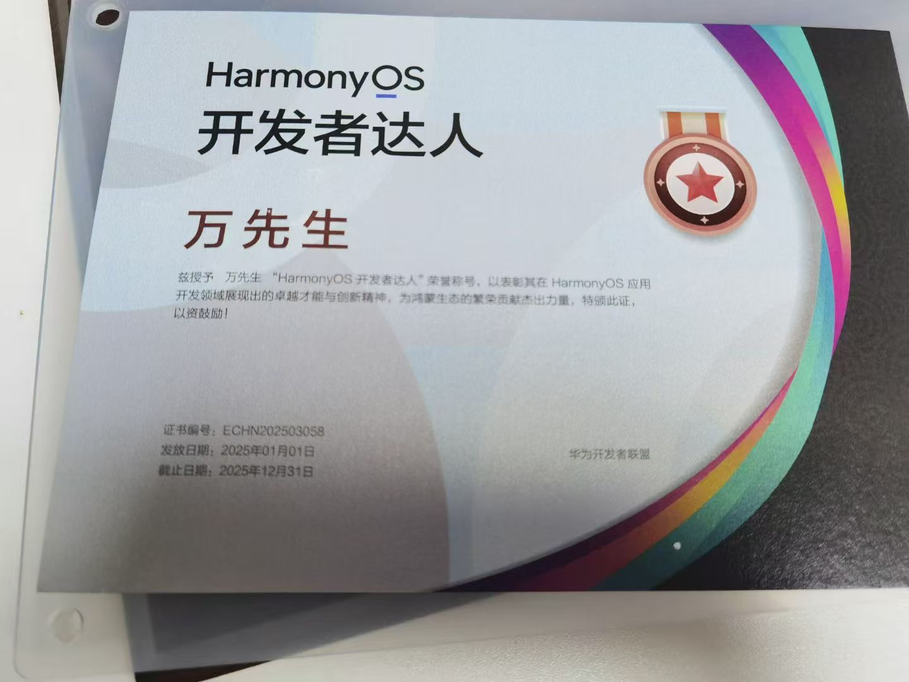
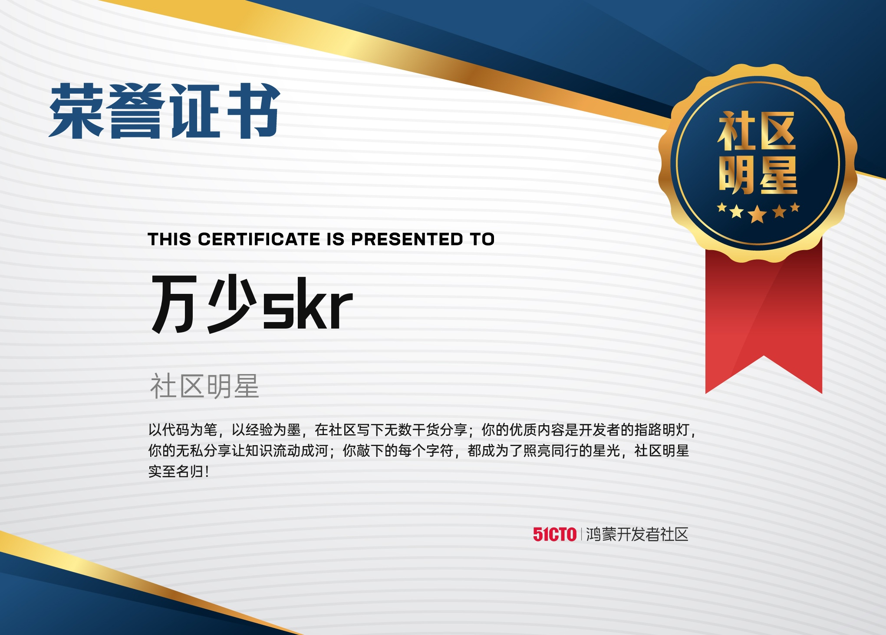
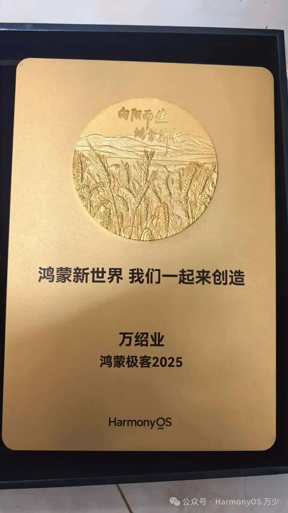
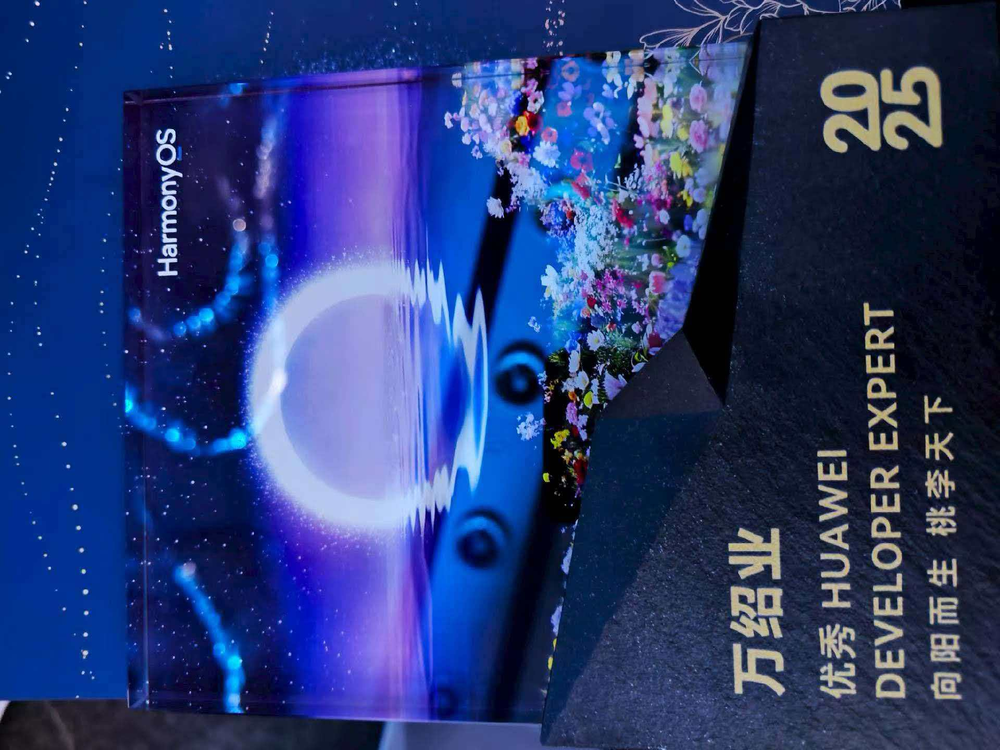

# 荣誉

欢迎来到荣誉展示页面，这里记录了万少（万绍业）在技术社区和技术布道方面获得的各项荣誉与认证。

## HUAWEI Developer Experts (HDE) - HarmonyOS

- **颁发机构**：华为终端云服务部
- **有效期限**：2025 年 2 月 - 2027 年 2 月
- **荣誉描述**：充分认可在 HarmonyOS 领域做出的出色成就，以及在推动全球开发者生态上做出的突出贡献。

## 鸿蒙应用开发培训讲师

- **颁发机构**：鸿蒙生态服务公司 (鸿蒙生态服务学堂)
- **发证日期**：2025 年 11 月 26 日
- **有效期限**：2027 年 11 月 26 日
- **荣誉描述**：在鸿蒙生态服务学堂顺利完成学习并通过了考核，获得专业证书。

## Huawei Cloud Developer Experts (HCDE)

- **颁发机构**：华为云
- **发证年度**：2024 年度
- **有效期限**：至 2025 年 12 月
- **荣誉描述**：华为云开发者专家计划认证专家。

## HarmonyOS 学习资源创作专家

- **颁发机构**：HarmonyOS
- **发证日期**：2025 年 8 月
- **有效期限**：2026 年 8 月
- **荣誉描述**：鉴于在第三期 HarmonyOS 学习资源贡献者招募活动中的突出贡献和卓越表现，特授予此荣誉称号。

## 阿里云专家博主 - 乘风者计划

- **颁发机构**：阿里云开发者社区
- **荣誉描述**：自在云间，乘风而上，感谢入驻乘风者计划并成为专家博主。

## 开发者达人

- **荣誉描述**：获得开发者达人称号。

## 社区明星

- **荣誉描述**：获得技术社区明星称号。

## 鸿蒙极客

- **荣誉描述**：获得鸿蒙极客称号，认可在鸿蒙生态中的探索与贡献。

## 其他荣誉

- **荣誉描述**：技术生态及社区其他相关荣誉认证。
